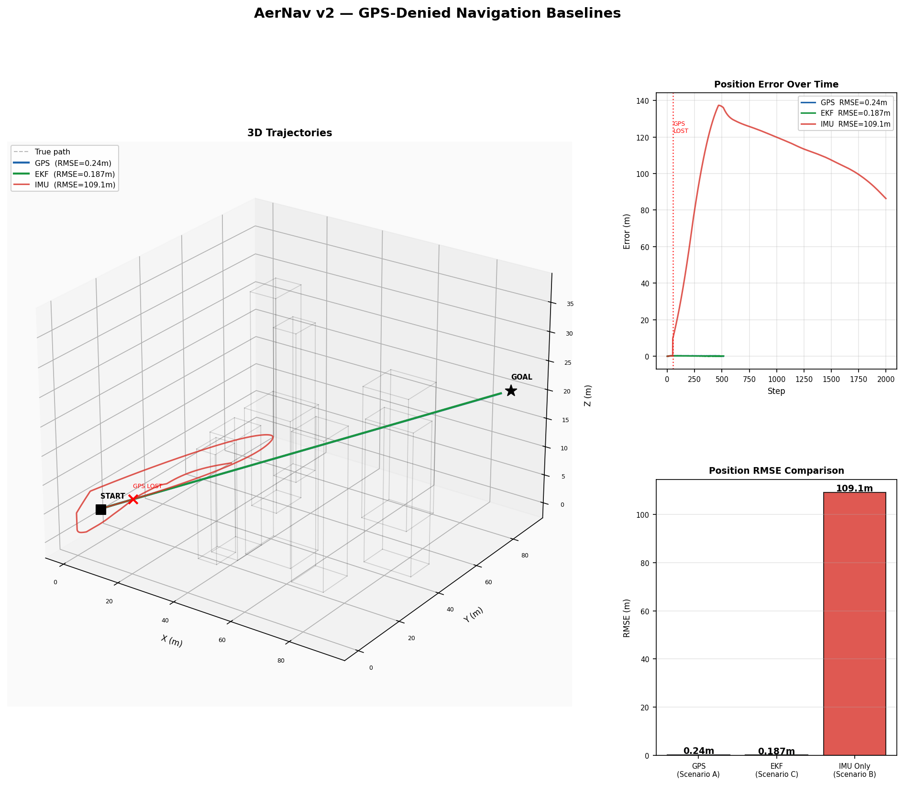
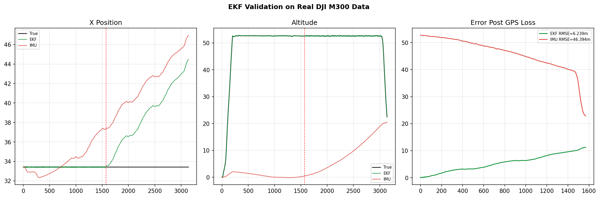
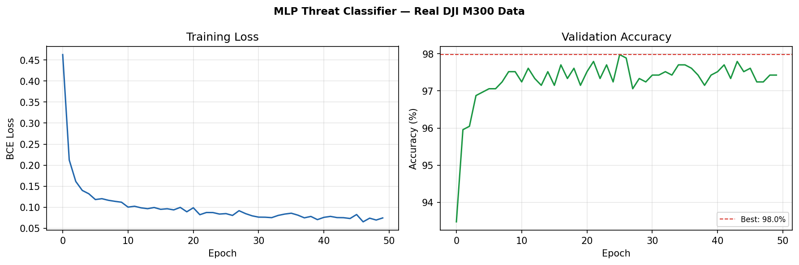
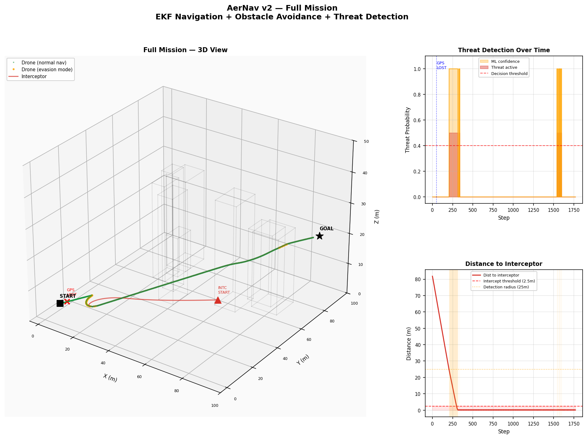

# AerNav v2 — GPS-Denied Drone Navigation with Threat Detection

> GPS-denied state estimation, obstacle avoidance, and ML-based interceptor detection.
> EKF validated on real DJI M300 flight data. Threat classifier trained on 54,726 real IMU samples.

---

## Problem

GPS is unavailable in urban canyons, indoor environments, and conflict zones.
A drone operating without GPS must simultaneously:
1. Know where it is — without satellite positioning
2. Avoid static obstacles — buildings, walls
3. Detect and evade hostile interceptor drones

**AerNav v2 solves all three.**

---

## System Architecture

    Sensors (IMU + Baro + Optical Flow)
               |
               v
      Extended Kalman Filter --> Position Estimate
               |
               v
      Obstacle Avoider (Potential Fields) --+
               |                            +--> Velocity Command --> Drone
      Threat Classifier (MLP PyTorch) ------+

---

## Results

### Simulation Baselines

| Scenario | RMSE | MAE | Max Error | Goal Reached |
|---|---|---|---|---|
| GPS Aided | 0.240m | 0.238m | 0.295m | YES |
| EKF (GPS-Denied) | 0.187m | 0.176m | 0.324m | YES |
| IMU Only | 109m | 106m | 137m | NO |

**EKF 583x better than IMU-only in simulation.**

### Real Data Validation — DJI M300 (Zenodo 7643456)

| Method | RMSE | MAE | Max Error |
|---|---|---|---|
| EKF (GPS-denied) | 4.638m | 4.066m | 8.537m |
| IMU only | 46.394m | 46.019m | 52.721m |

**EKF 10x better than IMU on real DJI M300 flight data.**

### Threat Classifier — MLP PyTorch

| Metric | Value |
|---|---|
| Accuracy | 97.8% |
| Precision (Threat) | 0.99 |
| Recall (Threat) | 0.97 |
| F1 Score | 0.98 |
| Training samples | 5,440 windows |
| Real data source | DJI M300 — 54,726 IMU samples |

---

## Plots

### Simulation Baselines

### EKF Validation on Real DJI M300 Data

### Threat Classifier Training

### Full Mission

---

## Technical Details

### Sensor Suite
| Sensor | Noise Model | Notes |
|---|---|---|
| GPS | sigma=0.02m | Disabled in GPS-denied mode |
| IMU | sigma_accel=0.08, sigma_gyro=0.005 | EuRoC noise params, bias drift |
| Barometer | sigma=0.1m | Altitude correction |
| Optical Flow | sigma=0.05 | Horizontal velocity, <20m only |

### Extended Kalman Filter
- 9-state: [px, py, pz, vx, vy, vz, roll, pitch, yaw]
- Implemented from scratch in NumPy
- Fuses IMU + barometer + optical flow + GPS (when available)

### Obstacle Avoidance
- Artificial Potential Fields
- Attractive force toward goal, repulsive force from each obstacle
- Blended with evasion command during threat detection

### Threat Classifier
- Architecture: MLP (23 -> 64 -> 32 -> 16 -> 1)
- Input: statistical features from 1-second IMU windows
- Detection: geometric proximity + ML confidence fusion
- Evasion: perpendicular maneuver blended with goal-seeking

---

## Limitations

- Simulation-based — not tested on real hardware
- Synthetic obstacle environment
- Threat classifier trained on flight state proxies, not true interceptor data
- No aerodynamic modeling of evasive maneuvers

---

## Repository Structure

    AerNav/
    |-- src/
    |   |-- simulation/      # 3D environment, drone dynamics
    |   |-- sensors/         # IMU, GPS, barometer, optical flow
    |   |-- estimation/      # Extended Kalman Filter
    |   |-- learning/        # MLP threat classifier
    |   `-- planning/        # Obstacle avoider, interceptor
    |-- models/
    |   |-- threat_classifier.pth
    |   `-- threat_scaler.pkl
    |-- data/
    |   `-- real/            # DJI M300 — Zenodo 7643456
    |-- results/
    `-- README.md

---

## Future Work

- Validate on real drone hardware (Crazyflie / DJI)
- Train threat classifier on dedicated interceptor dataset
- Replace potential fields with learned navigation policy
- Extend to multi-drone scenarios

---

## Tech Stack

| Tool | Purpose |
|---|---|
| NumPy | EKF, simulation, sensor models |
| PyTorch | MLP threat classifier |
| Matplotlib | Visualisation |
| scikit-learn | Preprocessing, evaluation |
| Zenodo DJI M300 | Real drone IMU validation data |

---

## Author

**Kanav Behl** — BE Electronics & CS, TIET Patiala
[GitHub](https://github.com/Kanav-22)

---

## References

- Kalman R.E. (1960). A New Approach to Linear Filtering
- Palamas et al. (2023). Drone Onboard Multi-Modal Sensor Dataset. Zenodo 7643456
- Khatib O. (1986). Real-Time Obstacle Avoidance for Manipulators and Mobile Robots
