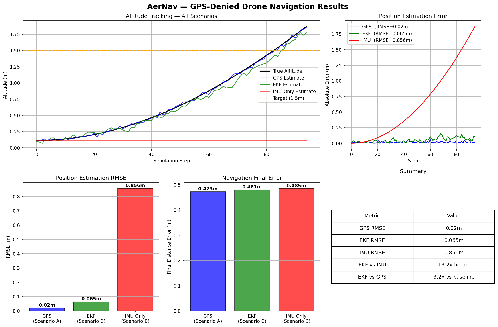

# AerNav — GPS-Denied Autonomous Drone Navigation

> Autonomous drone navigation using Extended Kalman Filter sensor fusion.
> Simulated in gym-pybullet-drones. EKF implemented from scratch in NumPy.

---

## Problem Statement

GPS is unavailable in indoor environments, urban canyons, and conflict zones.
AerNav solves this using sensor fusion via an Extended Kalman Filter (EKF).
By fusing IMU, barometer, and optical flow, the drone navigates without GPS.

---

## System Architecture

    IMU (accel + gyro)  --+
    Barometer           --+--> Extended Kalman Filter --> Position --> Controller
    Optical Flow        --+
    GPS (when available)--+

---

## Results

| Scenario | RMSE | MAE | Max Error | Drift Rate |
|---|---|---|---|---|
| A - GPS Aided | 0.018m | 0.015m | 0.047m | 0.25 mm/step |
| C - EKF GPS-Denied | 0.062m | 0.050m | 0.157m | 0.93 mm/step |
| B - IMU Only | 0.856m | 0.641m | 1.873m | 20.1 mm/step |

**EKF achieves 13.8x better RMSE than IMU-only. Drift rate 21x slower.**

---

## Flight Animation

GPS (blue) cuts out halfway. EKF (green) stays accurate. IMU (red) drifts off course.

---

## Sensor Suite (src/sensor_suite.py)

| Sensor | Noise | Notes |
|---|---|---|
| GPS | sigma=0.02m | Disabled in GPS-denied mode |
| IMU | sigma_accel=0.01, sigma_gyro=0.001 | Bias drift included |
| Barometer | sigma=0.1m | Altitude only |
| Optical Flow | sigma=0.05 | Fails above 5m |

---

## Extended Kalman Filter (src/estimation/ekf.py)

9-state EKF from scratch in NumPy.
State vector: [px, py, pz, vx, vy, vz, roll, pitch, yaw]

| Method | Purpose |
|---|---|
| predict(accel, gyro) | IMU propagation |
| update_baro(baro) | Barometer correction |
| update_optical_flow(flow) | Velocity correction |
| get_uncertainty() | Trace of covariance P |

---

## Key Findings

1. Raw IMU is unusable — 1.873m max error, drifts 20mm per step
2. EKF achieves near GPS-level accuracy — 0.062m RMSE without GPS
3. EKF drift rate 21x slower than IMU — critical for long flights
4. 13.8x improvement: EKF vs IMU on position RMSE

---

## Tech Stack

| Tool | Purpose |
|---|---|
| gym-pybullet-drones | Physics simulation |
| NumPy | EKF from scratch |
| Matplotlib | Visualisation + animation |
| Stable-Baselines3 | RL framework |

---

## Author

**Kanav Behl** — BE Electronics & CS, TIET Patiala
[GitHub](https://github.com/Kanav-22)

---

## References

- Kalman R.E. (1960). A New Approach to Linear Filtering and Prediction Problems
- Burri et al. (2016). The EuRoC Micro Aerial Vehicle Datasets. IJRR
- Panerati et al. (2021). Learning to Fly — gym-pybullet-drones
